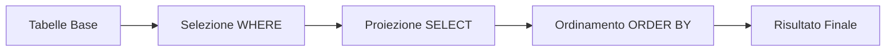

# Lezione Universitaria: Basi di Dati - Query SQL Avanzate

## Teoria e Pratica delle Operazioni SQL

---

## 1. Operatori per Filtri Avanzati

### Teoria degli Operatori
Gli operatori SQL estendono le capacità della clausola WHERE permettendo:
- **BETWEEN**: Verifica l'appartenenza a intervalli chiusi (estremi inclusi). Fondamentale per query su range temporali o valori numerici.
- **IN**: Ottimizza i confronti con insiemi discreti, più efficiente di multipli OR.
- **LIKE**: Implementa pattern matching con wildcard:
  - `%` corrisponde a 0+ caratteri
  - `_` corrisponde a 1 carattere
- **IS NULL**: Gestisce i valori mancanti (NULL ≠ 0 o stringa vuota)

### Esempi Pratici
```sql
-- BETWEEN per intervalli temporali
SELECT * FROM Prenotazioni
WHERE data_arrivo BETWEEN '2023-06-01' AND '2023-06-30';

-- IN con subquery
SELECT * FROM Prodotti
WHERE categoria_id IN (SELECT id FROM Categorie WHERE settore = 'Elettronica');

-- LIKE per ricerche testuali
SELECT * FROM Articoli
WHERE titolo LIKE 'Introduzione%Database%';

-- IS NULL per dati mancanti
SELECT * FROM Clienti
WHERE telefono IS NULL;
```

---

## 2. Alias di Attributi (AS)

### Teoria degli Alias
- **Funzione**: Forniscono nomi temporanei a colonne o espressioni.
- **Vantaggi**:
  - Migliorano la leggibilità.
  - Abbreviano sintassi in query complesse.
  - Obbligatori per alcune operazioni (es. self-join).
- **Sintassi**: `AS` è opzionale ma fortemente consigliato.

### Esempio Avanzato
```sql
SELECT 
    p.prezzo * (1 - p.sconto/100) AS "Prezzo Finale",
    CURRENT_DATE - p.data_inserimento AS "Giorni in Catalogo"
FROM Prodotti p;
```

---

## 3. Ordinamento dei Risultati (ORDER BY)

### Teoria dell'Ordinamento
- **Default**: ASC (crescente).
- **Meccanismo**: Può ordinare per:
  - Nomi colonna.
  - Posizione colonna (es. ORDER BY 2).
  - Espressioni/alias.
- **Multicolonna**: Priorità da sinistra a destra.

### Caso Complesso
```sql
SELECT 
    regione,
    COUNT(*) AS "Clienti",
    AVG(fatturato) AS "Media Fatturato"
FROM Clienti
GROUP BY regione
ORDER BY 
    CASE WHEN regione = 'Nord' THEN 1 ELSE 2 END,
    "Media Fatturato" DESC;
```

---

## 4. Operazioni di JOIN

### Teoria dei Join


| Tipo Join | Descrizione | Utilizzo Tipico |
|-----------|-------------|-----------------|
| INNER | Solo corrispondenze | Dati correlati |
| LEFT | Tutta tabella sinistra + corrispondenze | Report inclusivi |
| RIGHT | Tutta tabella destra + corrispondenze | Analisi complete |
| FULL | Tutti i record | Data integration |

### Esempio con Spiegazione
```sql
-- LEFT JOIN mantiene tutti i clienti anche senza ordini
SELECT c.nome, COUNT(o.id) AS "Numero Ordini"
FROM Clienti c
LEFT JOIN Ordini o ON c.id = o.cliente_id  -- Condizione di join
GROUP BY c.id;
-- Nota: COUNT(o.id) conta solo ordini esistenti (NULL→0)
```

---

## 5. Alias di Relazione

### Teoria degli Alias
- **Necessità**: Risolvere ambiguità in self-join o query complesse.
- **Best Practice**:
  - Usa alias brevi ma significativi (es. 'd' per Dipartimenti).
  - Mantieni coerenza in tutto lo script.
- **Particolarità**: Obbligatori nelle query ricorsive.

### Self-Join Avanzato
```sql
-- Gerarchia organizzativa
SELECT 
    d.nome AS "Dipendente",
    m.nome AS "Manager",
    d.livello - m.livello AS "Distanza Gerarchica"
FROM Impiegati d
LEFT JOIN Impiegati m ON d.manager_id = m.id;
```

---

## Esempio Integrato Completo

```sql
-- Report prodotti con analisi vendite
SELECT 
    p.id AS "Codice",
    p.nome AS "Prodotto",
    c.nome AS "Categoria",
    FORMAT(p.prezzo, 2) AS "Prezzo Unitario",
    COUNT(v.id) AS "Vendite Totali",
    SUM(v.quantità) AS "Pezzi Venduti",
    CASE 
        WHEN COUNT(v.id) = 0 THEN 'Nuovo'
        WHEN COUNT(v.id) > 20 THEN 'Best Seller'
        ELSE 'Standard'
    END AS "Status"
FROM Prodotti p
INNER JOIN Categorie c ON p.categoria_id = c.id
LEFT JOIN Vendite v ON p.id = v.prodotto_id
WHERE p.data_inserimento BETWEEN '2023-01-01' AND '2023-12-31'
    AND c.nome NOT LIKE '%Obsolet%'
GROUP BY p.id, c.nome
HAVING SUM(v.quantità) > 5 OR COUNT(v.id) = 0
ORDER BY "Pezzi Venduti" DESC, p.nome;
```

---

## Approfondimenti Teorici

### Ottimizzazione Query
1. **Indici**: Gli operatori BETWEEN e IN beneficiano di indici.
2. **NULL Logic**: `IS NULL` non può usare indici standard.
3. **Join Performance**: INNER JOIN è più efficiente di OUTER JOIN.

### Pattern Matching Avanzato
- **Regex**: Alcuni DBMS supportano `REGEXP_LIKE` per espressioni regolari.
- **Full-Text Search**: Alternative a LIKE per grandi volumi di testo.

### Relational Algebra
- **Proiezione** (SELECT): `π` in algebra relazionale.
- **Selezione** (WHERE): `σ`.
- **Join**: `⋈` con condizioni di join come pedice.


